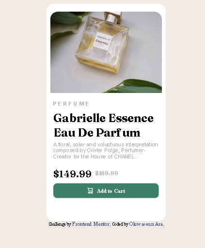

# Frontend Mentor - Product preview card component solution

This is a solution to the [Product preview card component challenge on Frontend Mentor](https://www.frontendmentor.io/challenges/product-preview-card-component-GO7UmttRfa). Frontend Mentor challenges help you improve your coding skills by building realistic projects.

## Table of contents

- [Overview](#overview)
  - [The challenge](#the-challenge)
  - [Screenshot](#screenshot)
  - [Links](#links)
- [My process](#my-process)
  - [Built with](#built-with)
  - [What I learned](#what-i-learned)
  - [Continued development](#continued-development)
- [Author](#author)

## Overview

### The challenge

Users should be able to:

- View the optimal layout depending on their device's screen size
- See hover and focus states for interactive elements

### Screenshot

### Links

- Solution URL: https://github.com/ Oluwaseun-Ara/product-preview-card

## My process

### Built with

- HTML5 symantic layout
- CSS design properties
- Flex and Grid layout

### What I learned
1. How to use flex properties and grid properties
2. Layout responsiveness
3. Use of rem, em, % and px
4. css display properties

### Continued development

- Need to understand the use of scales and measurement in px, % and rem.
- How and when to use flex and grid

## Author

- Website - [Oluwaseun Ara](https://github.com/Oluwaseun-Ara)
- Frontend Mentor - [@Oluwaseun-Ara](https://www.frontendmentor.io/profile/Oluwaseun-Ara)
- LinkedIn - [@Osunrayi Oluwaseun](https://www.linkedin.com/in/osunrayi-oluwaseun-b29472249)